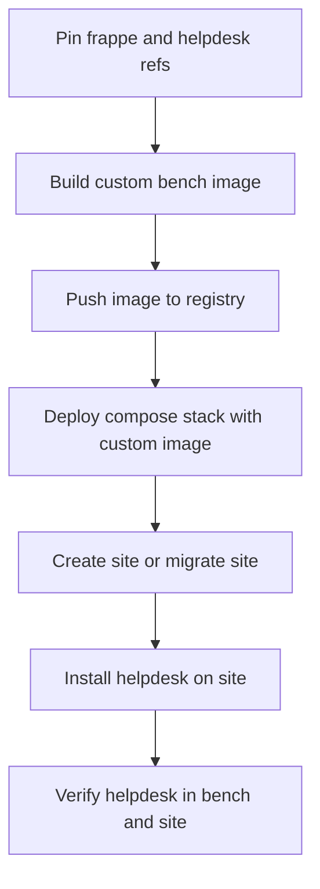

# Frappe Helpdesk Custom Image Plan

## Recommended upstream approach

Use the upstream custom bench image workflow based on [`bench init --apps_path`](helpdesk-image-template/Dockerfile:26) and a pinned [`apps.json`](apps.json). This is the recommended approach because it matches how [`frappe_docker`](README.md) assembles immutable application images during build time instead of cloning or installing apps at container startup. It keeps the resulting image reproducible, bench-compatible, and easy to version.

For a production-ready Frappe v15-style Helpdesk image, the implementation should:

- build the app set into the image at build time
- pin the Frappe base branch to `version-15`
- pin the Helpdesk app ref in [`apps.json`](apps.json)
- keep runtime containers immutable, with only `sites`, `assets`, and `logs` mounted as volumes
- use the image as the backend, queue, scheduler, websocket, and configurator workload image in a normal compose deployment

## Why this approach over alternatives

Preferred:
- custom image built from upstream base image using [`bench init --apps_path`](helpdesk-image-template/Dockerfile:26)
- apps declared in a manifest like [`apps.json`](apps.json)
- app code baked into the image

Not preferred:
- `bench get-app` and `bench install-app` during container startup
- bind-mounting app repositories into production containers
- ad hoc init scripts that mutate the image filesystem after deployment

Reason:
- the upstream custom-image pattern is repeatable, easier to pin, simpler to audit, and aligns with immutable container deployment guidance already implied by the repository docs.

## Planned repository structure

Create a dedicated build context for the reusable image, for example:

```text
helpdesk-image/
├── apps.json
├── Dockerfile
├── .dockerignore
├── README.md
└── compose.build.yaml
```

If the repository should stay close to the existing template layout, the same content can live under [`helpdesk-image-template/`](helpdesk-image-template/Dockerfile). The cleaner production option is a separate [`helpdesk-image/README.md`](plans/helpdesk-image-plan.md) style subtree so the template and the real implementation do not conflict.

## Concrete files to create or adapt

### 1. [`helpdesk-image/apps.json`](plans/helpdesk-image-plan.md)

Purpose:
- single source of truth for custom app inclusion
- pin Helpdesk to a specific ref compatible with Frappe v15

Content strategy:
- include Helpdesk only unless another app is explicitly required
- pin to a tag or commit, not `main`

Recommended shape:

```json
[
  {
    "url": "https://github.com/frappe/helpdesk",
    "branch": "version-15"
  }
]
```

If upstream Helpdesk uses release tags instead of a long-lived `version-15` branch, pin to the exact release tag or commit SHA instead. The key rule is to avoid floating refs for production.

### 2. [`helpdesk-image/Dockerfile`](plans/helpdesk-image-plan.md)

Purpose:
- follow the upstream custom-image pattern from [`helpdesk-image-template/Dockerfile`](helpdesk-image-template/Dockerfile:1)
- build a bench image that already contains Helpdesk

Recommended design:
- base on `frappe/base:version-15`
- copy pinned [`apps.json`](apps.json)
- run `bench init --apps_path`
- remove embedded git metadata from `apps`
- leave runtime entrypoint behavior compatible with normal bench containers

Recommended file content:

```dockerfile
ARG FRAPPE_PATH=https://github.com/frappe/frappe
ARG FRAPPE_BRANCH=version-15

FROM frappe/base:${FRAPPE_BRANCH} AS builder

ARG FRAPPE_PATH
ARG FRAPPE_BRANCH

USER root

RUN apt-get update && apt-get install -y \
    git \
    jq \
    pkg-config \
    build-essential \
    libmariadb-dev \
    libmariadb-dev-compat \
    && rm -rf /var/lib/apt/lists/*

USER frappe
WORKDIR /home/frappe

COPY --chown=frappe:frappe apps.json /home/frappe/apps.json

RUN bench init \
    --frappe-branch=${FRAPPE_BRANCH} \
    --frappe-path=${FRAPPE_PATH} \
    --apps_path=/home/frappe/apps.json \
    --no-procfile \
    --no-backups \
    --skip-redis-config-generation \
    --verbose \
    /home/frappe/frappe-bench \
 && cd /home/frappe/frappe-bench \
 && echo {} > sites/common_site_config.json \
 && find apps -mindepth 1 -path '*/.git' | xargs rm -rf

FROM frappe/base:${FRAPPE_BRANCH}

ARG FRAPPE_BRANCH
LABEL org.opencontainers.image.title=frappe-helpdesk
LABEL org.opencontainers.image.description=Custom Frappe bench image with Helpdesk baked in
LABEL org.opencontainers.image.version=${FRAPPE_BRANCH}

USER frappe
COPY --from=builder --chown=frappe:frappe /home/frappe/frappe-bench /home/frappe/frappe-bench
WORKDIR /home/frappe/frappe-bench

VOLUME ["/home/frappe/frappe-bench/sites", "/home/frappe/frappe-bench/sites/assets", "/home/frappe/frappe-bench/logs"]

CMD ["/bin/bash"]
```

Notes:
- this stays close to the upstream template and is easy to maintain
- no runtime `get-app` logic is needed
- the final image is reusable across backend and worker services

### 3. [`helpdesk-image/.dockerignore`](plans/helpdesk-image-plan.md)

Purpose:
- keep build context small and deterministic

Recommended content:

```dockerignore
.git
.gitignore
.env
__pycache__
*.pyc
*.pyo
*.pyd
*.swp
*.swo
node_modules
sites
logs
assets
.dist
build
```

### 4. [`helpdesk-image/compose.build.yaml`](plans/helpdesk-image-plan.md)

Purpose:
- standardize local and CI builds
- keep build arguments explicit

Recommended content:

```yaml
services:
  helpdesk-image:
    image: ghcr.io/example/frappe-helpdesk:v15-helpdesk1
    build:
      context: .
      dockerfile: Dockerfile
      args:
        FRAPPE_PATH: https://github.com/frappe/frappe
        FRAPPE_BRANCH: version-15
```

This compose file is only for image build convenience. It is not the full production deployment file.

### 5. [`helpdesk-image/README.md`](plans/helpdesk-image-plan.md)

Purpose:
- document build, tag, verify, and deploy steps next to the implementation

## Tagging and version pinning strategy

Use explicit image tags that encode both the framework line and your image revision.

Recommended tag style:

```text
frappe-helpdesk:15.0.0-helpdesk.1
frappe-helpdesk:15.0.0-helpdesk.2
frappe-helpdesk:version-15-20260325
```

Pinning rules:
- pin `FRAPPE_BRANCH` to `version-15`
- pin Helpdesk in [`apps.json`](apps.json) to a release branch, tag, or commit SHA
- if strict reproducibility is required, replace branch refs with immutable commit SHAs
- update the image tag whenever either Frappe or Helpdesk pins change

## Build workflow

Recommended commands:

```bash
docker build \
  --file helpdesk-image/Dockerfile \
  --tag ghcr.io/example/frappe-helpdesk:15.0.0-helpdesk.1 \
  helpdesk-image
```

Or with compose:

```bash
docker compose -f helpdesk-image/compose.build.yaml build
```

If publishing to a registry:

```bash
docker push ghcr.io/example/frappe-helpdesk:15.0.0-helpdesk.1
```

## Verification workflow

### Static verification

Confirm the app is baked into the image:

```bash
docker run --rm ghcr.io/example/frappe-helpdesk:15.0.0-helpdesk.1 \
  bash -lc 'ls -1 apps && test -d apps/helpdesk'
```

### Bench-level verification

```bash
docker run --rm ghcr.io/example/frappe-helpdesk:15.0.0-helpdesk.1 \
  bash -lc 'bench version'
```

Expected outcome:
- `helpdesk` appears in the app tree
- `bench version` lists the installed app source present in the bench

### Runtime verification after site install

After creating a site and installing Helpdesk on that site:

```bash
bench --site <site-name> list-apps
```

Expected outcome:
- `helpdesk` appears in the site app list

Important distinction:
- baking Helpdesk into the image makes the app available in the bench
- a site still needs `bench --site <site-name> install-app helpdesk` once during site provisioning unless your deployment automation already performs that step

## Typical deployment usage

Use the custom image everywhere the standard bench image would normally be used.

Representative service mapping:
- `backend`
- `queue-short`
- `queue-long`
- `scheduler`
- `websocket`
- optional one-shot `configurator` or `create-site` job

Example deployment override fragment:

```yaml
services:
  backend:
    image: ghcr.io/example/frappe-helpdesk:15.0.0-helpdesk.1

  queue-short:
    image: ghcr.io/example/frappe-helpdesk:15.0.0-helpdesk.1

  queue-long:
    image: ghcr.io/example/frappe-helpdesk:15.0.0-helpdesk.1

  scheduler:
    image: ghcr.io/example/frappe-helpdesk:15.0.0-helpdesk.1

  websocket:
    image: ghcr.io/example/frappe-helpdesk:15.0.0-helpdesk.1
```

This preserves bench-container compatibility because every workload receives the same baked application tree.

## Site provisioning and app installation strategy

Recommended strategy:
- bake Helpdesk into the image at build time
- install Helpdesk onto each site during provisioning, migration, or first-run automation
- do not clone the app at runtime

This splits responsibilities cleanly:
- image build controls application code
- site lifecycle automation controls database state

## Supporting configuration to include

Document these inputs as configurable defaults:
- `FRAPPE_BRANCH=version-15`
- `FRAPPE_PATH=https://github.com/frappe/frappe`
- image tag variable for deployment reuse
- pinned [`apps.json`](apps.json)

Optional but useful:
- OCI labels in the Dockerfile
- registry and image tag variables in a `.env` file used by compose
- CI workflow later for automated build and publish

## Recommended implementation sequence

1. Create a dedicated [`helpdesk-image/apps.json`](plans/helpdesk-image-plan.md) pinned for Frappe v15 and Helpdesk.
2. Create [`helpdesk-image/Dockerfile`](plans/helpdesk-image-plan.md) using the upstream custom-image pattern from [`helpdesk-image-template/Dockerfile`](helpdesk-image-template/Dockerfile:1).
3. Add [`helpdesk-image/.dockerignore`](plans/helpdesk-image-plan.md) to keep builds clean.
4. Add [`helpdesk-image/compose.build.yaml`](plans/helpdesk-image-plan.md) for repeatable local and CI image builds.
5. Add [`helpdesk-image/README.md`](plans/helpdesk-image-plan.md) documenting build, tag, verification, and deployment usage.
6. Optionally add a production compose override that swaps the bench service images to the new Helpdesk image.

## Minimal deployment flow



## Review checkpoint

This plan intentionally chooses the upstream custom image pattern instead of runtime app installation because it is the most maintainable and production-safe option in [`frappe_docker`](README.md).
